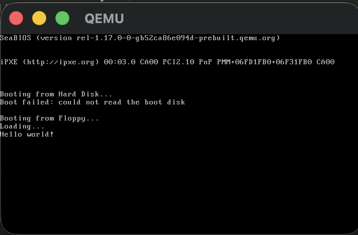
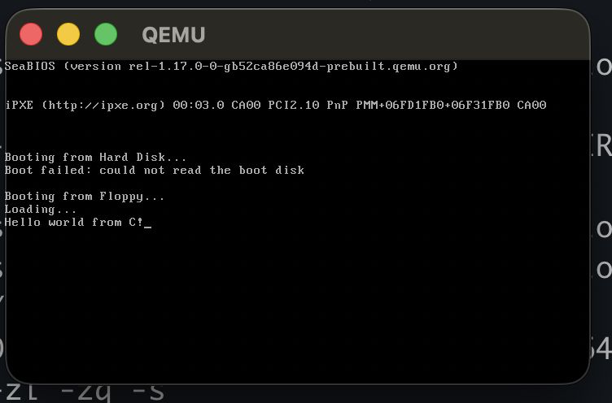

- [Assembly](#assembly)
  - [How a computer startup ?](#how-a-computer-startup-)
  - [How BIOS find the OS ?](#how-bios-find-the-os-)
  - [Directive vs Instruction](#directive-vs-instruction)
  - [Memory segmentation](#memory-segmentation)
  - [How to reference a memory location in assembly ?](#how-to-reference-a-memory-location-in-assembly-)
- [Bootloader](#bootloader)
  - [Floppy disk](#floppy-disk)
- [FileSystem](#filesystem)
- [Writing bootloader in C](#writing-bootloader-in-c)
  - [Roles of booloader ?](#roles-of-booloader-)
  - [Referencing a memory location](#referencing-a-memory-location)
- [16-Bit Pointers: Near, Far, and Huge](#16-bit-pointers-near-far-and-huge)
    - [1. Near Pointers](#1-near-pointers)
    - [2. Far Pointers](#2-far-pointers)
    - [3. Huge Pointers \& "Normalization"](#3-huge-pointers--normalization)
- [Which compiler ?](#which-compiler-)
  - [The Memory Models](#the-memory-models)
- [Calling Convention](#calling-convention)
  - [`c_decl` calling convention Rules](#c_decl-calling-convention-rules)
  - [Finally Hello world from C](#finally-hello-world-from-c)
- [Extras](#extras)
  - [Demystifying Segment Overlap and Normalization](#demystifying-segment-overlap-and-normalization)
    - [1. The Physical Address Formula](#1-the-physical-address-formula)
    - [2. The Math Proof](#2-the-math-proof)
    - [3. Why is it designed like this? (The Overlap)](#3-why-is-it-designed-like-this-the-overlap)
    - [4. What is "Normalization"?](#4-what-is-normalization)
  - [Demystifying Segment Overlap and Normalization](#demystifying-segment-overlap-and-normalization-1)
    - [1. The Physical Address Formula](#1-the-physical-address-formula-1)
    - [2. The Math Proof](#2-the-math-proof-1)
    - [3. Why is it designed like this? (The Overlap)](#3-why-is-it-designed-like-this-the-overlap-1)
    - [4. What is "Normalization"?](#4-what-is-normalization-1)
- [References](#references)
- [Extras: Installing Open Watcom v2 (macOS ARM64)](#extras-installing-open-watcom-v2-macos-arm64)
  - [Verifying the 16-bit Toolchain](#verifying-the-16-bit-toolchain)

## Assembly 

### How a computer startup ? 
- BIOS is copied from ROM to RAM
- BIOS start executing code
  - initialize the hardware
  - runs some test (POST)
- BIOS search for an operating system to load into the memory

### How BIOS find the OS ?
- Legacy booting
  - BIOS loads first sector of each bootable device into the memory at the location `0x7C00`
  - Check for a `0xAA55` signature
  - If found, then jumps to the first insturction in the loaded block
- EFI 
  - BIOS looks into specific EFI partitions
  - OS must be compiled using as an EFI programs

### Directive vs Instruction
- Directive
  - Gives a clue to the assembler that will affect how the program gets compiled. 
  - A directive is not translated to a machine code
- Instruction
  - Translates to a machine code instruction 
- `ORG` origin directive
  - Tells assembler where we expect our code to be loaded
  - It is not a CPU instruction - it only affect how assembler calculate addresses and labels. So it doesn't tell CPU where to execute the code
  - The assembler uses this information to calculate the label addresses 
- `bits` directive
  - Tell essembler to emit 16-bit code
  - It doesn't mean that processor will run in 16-bit or 32 or 64 
- `main` label
  - Entry point for the code
- `hlt` instruction
  - Stops CPU from executing
  - It can be resume by an interrupt
- `jmp label`
  - jumps to a given label
- `DB byte1 byte2 byte3` directive
  - Stand for define byte(s)
  - Write given bytes to the assembled binary file
  - bios require the last two sector are `0xAA55`
- `TIMES number of instruction/data` directive
  - Repeat given insturction or piece of data a number of times
- `$`
  - Special symbol which is equal to the memory offset of current line
- `$$`
  - Special symbol which is equal to the memory offset of the beginning of the current section (in our case, program)
- `$ - $$` 
  - Gives the size of our program so far in bytes
- `DW word1 word2 word3` directive
  - Define word(s)
  - Write given word(s) 2 byte value, encoded in little endian to the assembled binary file
- Why `510 - ($ - $$)` ?
  - total = 512 byte = 1 sector
  - Last 2 byte are for the signature
  - So remaining is 510
  - How many we have already filled ?
    - Start = `$$`
    - Current = `$`
    - Current - Start
  - So we have to fill `0` in `510 - ($ - $$)` bytes

### Memory segmentation
  - Segment:offset
  - Each segment can contains 64KB of memory
  - Segment overlap at 16 bytes
    - Segment i start = Segment i - 1 start + 2 byte
  - `real_address` = `segment# * 16` (4 bit shift left) + `offset`
  - There are multiple ways to name same address in the memory, because of different segment_#
- As mentioned Physical address = segment * 16 + offset
  - Ex. `mov al, [0x0020]` the CPU doesn't read from physical address `0x0020`. It first choose the default segment DS, then compute the physical address. 
    - DS * 16 + offset
    - 0x1000 * 16 + 0x0020
    - 0x10000 + 0x0020
    - 0x10020
  - So the actual address from where byte is read is 0x10020
  - Different kinds of instructions have different default segment register. The notation is segment_base:offset
    - `mov al, [var]` DS:var
    - `push ax`  SS:SP
    - `pop bx`   SS:SP (Stack Segment: Stack Pointer)
    - intruction fetch  CS:IP (Code segment: Instruction Pointer)
    - `movsb` destination ES:DI
  - You can override default if you want
    - `mov al, [0x020]` -> `mov al, [es:0x020]`
- There are special register to specify the current active segment
  - **CS**: currently running code segment
    - **IP** gives the offset
  - **DS**: Data segment
    - 
  - **SS**: stack segment
  - **ES**, **FS**, **GS** - extra data segments

### How to reference a memory location in assembly ?
- Memory location 
  - `segment: [base + index * scale + displacement]`
  - segment: CS, DS, ES, FS, GS, SS (DS if not specified)
  - base: 16 bit BP/BX (limitation), 32/64 bits any general purpose register
  - index: 16 bit SI/DI (limitation), 32/64 bits any general purpose register
  - scale: (32, 64 bit only) 1, 2, 4, 8
  - displacement: a signed constant value
- `mov destination, source` 
  - Copies data from source (register, memory reference, constant) to destination (register or memory reference)
- The stack
  - Memory access in a FIFO (first in, first out) manner using `push` and `pop` 
  - Used to save the return address when calling functions
  - It grows downwards
  - That's why we will setup our sp to the `0x7C00` becuase it will grow downwards towards 0 from `0x7C00` (safe spot)
- `LODSB`, `LODSW`, `LODSD`
  - These instruction loads a byte/word/double word from DS:SI into the AL/AX/EAX, then increment SI by the number of bytes loaded
    - `AL = [DS:SI]`
    - `SI = SI + 1`
- `jz destination`
  - Jumps to the destination if zero flag is set
- BIOS can help us to print the character on the screen
  - This we can achieve using the interrupts
  - A signal which makes the processor stop what it is doing, in order to handle the signal
  - Three way to trigger an interrupt 
    - An exception (e.g., divide by zero, segmentation fault, page fault)
    - Hardware (e.g., keyboard, timer ticks, disk controller finish some operation)
    - Sofware, through the INT instruction 
      - INT [0 to 255]
  - BIOS has interrupt handler for us, so that we can use this functionality 
    - INT 10h : video
    - INT 11h : Equipment check 
    - INT 12h : memory size 
    - INT 13h : Disk I/O
    - INT 14h : Serial communication 
    - INT 16h : Keyboard I/O 
- BIOS INT 10h, h represent hexadecima
  - By setting AH = 0Eh we can write character in TTY mode 
  - Read more here [INT 10H/0x10](https://en.wikipedia.org/wiki/INT_10H) and the list of supported function 
  - The function that we will use is 0x0e
  - To tell which function to use we will `ah` register
  - And the page number = 0, using `bh`
  - Check the wiki page to understand the argument it takes
  - It reads `al` register and the same is written by `lodsb`
  - When your raise the interrupt. The handler is dispatch which in this case is the teletype function which reads the register you have setup and simply print onto the screen and move the cursor to the next.

## Bootloader
- loads basic components into memory
- puts system in expected state
- collects information about system 
- Modern operating system expect bootloader to make a switch to 32-bit protected mode and also collect some information
- Some of the fuction which are only applicable for 16bit are no more use in the 32 bit
- So bootloader responsiblity to collect all the information before it start the main kernel 

### Floppy disk
- ease to use 
- universal support by all BIOS
- FAT12 file system one of the simplest file system
- Simplest way we can use disk is 1st sector = boot sector and rest of operating system start from sector 2

- When we attempted to copy the bootloader to the first sector it wiped out the parameters which are used by the FAT12 which we created in the previous step 
    ```bash
    $(FLOPPY_IMAGE): bootloader kernel 
      $(DD) if=/dev/zero of=$(FLOPPY_IMAGE) bs=$(FLOPPY_SECTOR_SIZE) count=$(FLOPPY_BLOCKS)
      $(MFORMAT) -i $(FLOPPY_IMAGE) -f $(FLOPPY_SIZE) -v BOOT ::
      $(DD) if=$(BOOTLOADER_BIN) of=$(FLOPPY_IMAGE) conv=notrunc
      $(MCOPY) -i $(FLOPPY_IMAGE) $(KERNEL_BIN) ::kernel.bin
    ```
- By overriding we have broken the file system
    ```bash
    mformat  -i build/floppy_boot.img -f 1440  -v BOOT ::
    dd if=build/bootloader.bin of=build/floppy_boot.img conv=notrunc
    1+0 records in
    1+0 records out
    512 bytes transferred in 0.000043 secs (11906977 bytes/sec)
    mcopy -i build/floppy_boot.img build/kernel.bin ::kernel.bin
    init :: non DOS media
    Cannot initialize '::'
    ::kernel.bin: Undefined error: 0
    make: *** [build/floppy_boot.img] Error 1
    ```
- Solution is to add these to our bootloader
  - Check this [FAT-12](https://wiki.osdev.org/FAT)
  - You can name the variable anything of your choice, but you have to ensure the actual byte your are writing matching the spec using `db` directive
- Disk layout
  - Track/Cylinder
  - Sector 
  - Head (each side of platter)
- To read/write, we need to tell the disk controller
  - Cyliner number, Head number, Sector number (CHS scheme)
- Logical Block Addressing schemed:
  - Instead of triplet of number, we only need one single number to reference a block on the disk. 
  - Unfortunately the BIOS function we wil use only support CHS addressing
- LBA to CHS conversion
  - sector per track/cylinder (on a single side)
  - heads per cylinder (or just heads)
  - sector = (LBA % sector per track) + 1  (sector is base 1)
  - head = (LBA / sector per track) % heads
  - cylinder = (LBA / sector per track) / heads

## FileSystem
- Organizing peices of data on a disk 
- We will understand FAT 12 
- A FAT disk is organized in to four region
  - Reserved (Boot loader + additional metadata)
  - File Allocation Table (FAT)
    - Look up table to get the next block of data
  - Root directory
    - Table of content of disk
  - Data region
- How to find the location of root directory (third region) ?
  - Lets caculate the size of first two : Reserved and FAT 
  - Mostly reserved in 1 sector
  - 2nd region: FAT count * Sector per FAT 
- Root directory size (in number of sectors)?
  - ceil (Number of directory entry count * size of each entry) / size of each sector in byte
  - This is what we will read into the memory
- "The root directory"
  - Lets now go through these directory entries and see how we can find out the file we are looking for ?
    - Each entry (Filename, Attr, Creation time, Creation date, Access date, First cluster (high), Modified time, Modified date, First cluster (low), Size)
    - The low and high 'first cluster' signifies the. Together they for 32 bit number which is useful in FAT32, but in our case we using FAT12, so we need lower 16 bits 
    - File name is max up to the 11 char long
      - We need to compare with this
- So what are these cluster exactly ? 
  - Just like disk uses blocks called 'sector'
  - FAT called blocks called as 'cluster'
  - The conversion is defined in the field in the boot sector named as 'sector per cluster'
- Since we know where is the first cluster of the file is located, we can already read the first block of file in the memory
  - The cluster number (first cluster (high + low)) gives us the location in the data region. 
  - And this cluster number start from 2 (i.e., start index is 2)
  - So to convert it to the sector number
    - Size of first 3 region = bootsector + FAT table + root. Let say this as data_region_begin
    - So formulation is = data_region_begin + (cluster - 2) * sector_per_cluster;
  - Now that is the first cluster. How to get the next cluster ? This is where FAT will come into the play
    - This is simple lookup table, where the index of an entry corresponds to the cluster number and the entry indicate the next cluster
    - The size of each entry depends on the FAT type
    - FAT 12 each entry is 12 bits
  - The last cluster ?
    - FFF
- What if the file we are trying to find is not in the root directory ? And it may be inside some folder ?
  1. Split path into components parts (and convert to the FAT file naming scheme)
    - Foo\bar\hello.txt -> "Foo         ", "Bar        ", "Hello      txt" 
  2. Read the first directory from the root directory, using same procedure as reading files. Directories have same structure as the root directory, and can be read just like ordinary file
  3. Search the next component from the path in the directory, and read it
  4. Repeat until reach the file

- Some BIOS might start with 07C0:0000 instead of 0000:07C0
  - We can use returnf to alter the CS and IP [RETF](https://pushbx.org/ecm/doc/insref.pdf)
    - Execute a far return: after popping IP/EIP, it then pops CS, and then increments the stack pointer by the optional argument if present

- 

## Writing bootloader in C
- When a computer boots from a disk, the BIOS is hard-coded to load exactly one sector (the first 512 bytes) from the storage device into memory. This tiny space must contain the bootloader code and the partition table, leaving almost no room for anything else.
- High-level languages like C rely on compilers that generate machine code with significant "overhead." This includes setup routines, library dependencies, stack management, and calling conventions that help structure programs. This generated machine code is significantly larger and less dense than manually optimized assembly code
- But now we are in stage 2, we can start writing code in C. 

### Roles of booloader ?
- Collect information about the system 
- Put system in state expected by the kernel
  - Move from 16-bit to 64-bit mode
  - We will create second stage of our bootloader which will do all of this
- Loads and execute the kernel
  
### Referencing a memory location 
- segment: [base + index * scale + displacement] 
- All fields are optional
  - segment: CS, DS, ES, FS, GS, SS 
  - base: 16 bit - BP/BX
  - index: 16 bit - SI/DI
  - scale: (32/64 bits only) 1, 2, 4, 8
  - displacement: a signed constant value 

## 16-Bit Pointers: Near, Far, and Huge

To understand the memory models, we first have to deconstruct the pointers themselves. The models simply dictate which of these pointers the compiler uses by default.

#### 1. Near Pointers
A near pointer is exactly **16 bits (2 bytes)** long. 
*   **What it stores:** It stores *only the offset*. 
*   **How it works:** Because it only has an offset, the CPU implicitly assumes the segment based on what operation is occurring (`CS` for executing code, `DS` for reading data, `SS` for the stack).
*   **Pros/Cons:** It is incredibly fast. Moving a near pointer into a register takes one CPU cycle. However, it can never access data outside its default 64KB segment.
*   **Example:** If you write `char *ptr = 0x1234;` in the Small memory model, the compiler emits machine code that only passes around `0x1234`. It completely trusts that `DS` is already pointing to the correct 64KB block of RAM.

#### 2. Far Pointers
A far pointer is **32 bits (4 bytes)** long.
*   **What it stores:** It stores *both the Segment and the Offset* (16 bits for each).
*   **How it works:** When you dereference a far pointer, the compiler must emit extra instructions. It saves the current segment register, loads the new segment from the pointer, performs the read/write, and then restores the old segment register.
*   **Pros/Cons:** It can address the entire 1MB of real-mode memory. The downside is performance cost (changing segment registers is slow) and memory footprint (pointers are twice as large).
*   **The Trap (Why we need Huge):** In C, pointer arithmetic on a far pointer *only affects the offset*. If your offset is `0xFFFF` (the end of the segment) and you do `ptr++`, the offset wraps around to `0x0000`. It does NOT increment the segment. Your code silently loops back to the beginning of the same 64KB block, likely overwriting your own data.

#### 3. Huge Pointers & "Normalization"

A huge pointer is also **32 bits**, storing Segment:Offset. The difference is entirely in how the compiler generates the assembly code for pointer arithmetic.
*   **Normalization:** Because physical segments overlap every 16 bytes, the address `0x1000:0x0010` points to the exact same physical byte of RAM as `0x1001:0x0000`. Normalization is the mathematical process of recalculating the pointer so that the offset is always strictly between `0` and `15`. 
*   **How it works:** When you do `ptr++` on a huge pointer, the compiler injects a hidden subroutine. It increments the offset, then checks if it crossed a 16-byte boundary. If it did, it adds 1 to the Segment and resets the offset. 
*   **Pros/Cons:** This allows a single C array to span multiple segments (larger than 64KB) without wrapping around. It simulates a flat memory space. The cost is a severe performance degradation, as every single `ptr++` requires division/modulo logic injected by the compiler.


## Which compiler ?
- There are many small C compilers - tiny C Compiler (tcc), bcc (bruce's C compiler), Smaller C 
- We will use open-watcom-v2 (See the section *Extras: Installing Open Watcom v2* for more details)

### The Memory Models

When you pass a flag like `-ms` (Small) or `-mc` (Compact) to Watcom, you are simply telling the compiler which type of pointer to use *by default* when it sees standard C types like `char *` or `void (*)()`.

1. **Tiny / Small (Code Near, Data Near)**
   *   `char *` defaults to Near (16-bit).
   *   Function pointers default to Near.
   *   *Tiny* puts Code, Data, and Stack in the exact same 64KB segment. *Small* puts Code in one 64KB segment, and Data/Stack in another.
   *   **Use case:** Bootloaders : Highest performance, lowest overhead.

2. **Medium (Code Far, Data Near)**
   *   Data pointers remain Near (16-bit). Data is locked to one 64KB segment.
   *   Function pointers become Far (32-bit). 
   *   **Use case:** Complex logic programs with little state. You can have 500KB of executable code spanning many segments, but memory reads/writes remain extremely fast because data is confined to a single near segment.

3. **Compact (Code Near, Data Far)**
   *   Function pointers remain Near (16-bit). Code must fit in 64KB.
   *   Data pointers become Far (32-bit). 
   *   **Use case:** Data processing. A small program that needs to read/write massive amounts of data across the entire 1MB address space. (Note: single arrays still cannot exceed 64KB because far arithmetic isn't normalized).

4. **Large (Code Far, Data Far)**
   *   All default pointers (both data and function) are Far (32-bit).
   *   **Use case:** Massive applications where both code and data exceed 64KB. This was the standard for heavy MS-DOS applications before 32-bit protected mode became common. 

5. **Huge (Code Far, Data Huge)**
   *   Function pointers are Far.
   *   Data pointers are Huge.
   *   **Use case:** You need a single monolithic array or data structure that is larger than 64KB. The compiler normalizes every pointer operation to simulate a flat memory space, paying a massive CPU penalty to do so.

## Calling Convention
- How function calls are made ?
  - What the caller and the function being called have to adhere to - So that function can be call in safe and predictable manner

### `c_decl` calling convention Rules
- Arguments:
  - Passed through the stack
  - Pushed from right to left
  - Caller removes parameter from stack, after the call return
- Returns:
  - integer, pointer : EAX
  - floating point: ST0 register
- Registers:
  - EAX, ECX, EDX are saved by the caller
  - All other saved by callee
- Name Mangling
  - Function name that uses `c_decl` call convention, will we prepended with and underscore (`_`)

### Finally Hello world from C 
- 

## Extras

### Demystifying Segment Overlap and Normalization

To understand why `0x1000:0x0010` and `0x1001:0x0000` are the exact same byte in RAM, you have to look at the hardware math the CPU performs every time a memory address is accessed.

#### 1. The Physical Address Formula
The CPU calculates the actual 20-bit silicon address using this formula:
`Physical Address = (Segment * 16) + Offset`

*(Note: In hexadecimal, multiplying by 16 is exactly the same as adding a zero to the right side, or shifting left by 4 bits. `0x1000 * 16 = 0x10000`)*

#### 2. The Math Proof
Let's run the formula on the two logical addresses from the example.

**Pointer A: `0x1000:0x0010`**
1. Take the segment: `0x1000`
2. Multiply by 16: `0x10000`
3. Add the offset: `0x0010`
4. **Final Physical Address = `0x10010`**

**Pointer B: `0x1001:0x0000`**
1. Take the segment: `0x1001`
2. Multiply by 16: `0x10010`
3. Add the offset: `0x0000`
4. **Final Physical Address = `0x10010`**

Both pointers mathematically resolve to the exact same byte in your RAM. 

#### 3. Why is it designed like this? (The Overlap)
A segment doesn't start where the last one ended. **A new segment starts every 16 bytes.** 
* `Segment 0x0000` starts at physical byte `0`.
* `Segment 0x0001` starts at physical byte `16`.
* `Segment 0x0002` starts at physical byte `32`.

This 16-byte gap is called a "paragraph" in x86 terminology. Because your offset can go all the way up to `0xFFFF` (65,535), your offset can reach *deep* into the territory of the segments that come after it. 

There are literally 4,096 different `Segment:Offset` combinations that can point to the exact same physical byte of RAM.

#### 4. What is "Normalization"?
Because there are thousands of ways to write the same address, it creates a nightmare for the C compiler. If you ask the compiler `if (ptrA == ptrB)`, they might physically point to the same byte, but the compiler will say they are "not equal" because the logical segment/offset numbers are different.

**Normalization** is a mathematical routine the compiler injects to ensure a pointer is always written in its most "canonical" or standardized form. 

The standard rule for a normalized pointer is: **The offset must never exceed 15 (`0x000F`).**

If you have a Huge pointer at `0x1001:0x000F` and you increment it (`ptr++`), the offset becomes 16 (`0x0010`). The compiler intercepts this, shifts the segment up by 1, and resets the offset to 0.
* Before normalization: `0x1001:0x0010`
* After normalization:  `0x1002:0x0000`


### Demystifying Segment Overlap and Normalization

To understand why `0x1000:0x0010` and `0x1001:0x0000` are the exact same byte in RAM, you have to look at the hardware math the CPU performs every time a memory address is accessed.

#### 1. The Physical Address Formula
The CPU calculates the actual 20-bit silicon address using this formula:
`Physical Address = (Segment * 16) + Offset`

*(Note: In hexadecimal, multiplying by 16 is exactly the same as adding a zero to the right side, or shifting left by 4 bits. `0x1000 * 16 = 0x10000`)*

#### 2. The Math Proof
Let's run the formula on the two logical addresses from the example.

**Pointer A: `0x1000:0x0010`**
1. Take the segment: `0x1000`
2. Multiply by 16: `0x10000`
3. Add the offset: `0x0010`
4. **Final Physical Address = `0x10010`**

**Pointer B: `0x1001:0x0000`**
1. Take the segment: `0x1001`
2. Multiply by 16: `0x10010`
3. Add the offset: `0x0000`
4. **Final Physical Address = `0x10010`**

Both pointers mathematically resolve to the exact same byte in your RAM. 

#### 3. Why is it designed like this? (The Overlap)
A segment doesn't start where the last one ended. **A new segment starts every 16 bytes.** 
* `Segment 0x0000` starts at physical byte `0`.
* `Segment 0x0001` starts at physical byte `16`.
* `Segment 0x0002` starts at physical byte `32`.

This 16-byte gap is called a "paragraph" in x86 terminology. Because your offset can go all the way up to `0xFFFF` (65,535), your offset can reach *deep* into the territory of the segments that come after it. 

There are literally 4,096 different `Segment:Offset` combinations that can point to the exact same physical byte of RAM.

#### 4. What is "Normalization"?
Because there are thousands of ways to write the same address, it creates a nightmare for the C compiler. If you ask the compiler `if (ptrA == ptrB)`, they might physically point to the same byte, but the compiler will say they are "not equal" because the logical segment/offset numbers are different.

**Normalization** is a mathematical routine the compiler injects to ensure a pointer is always written in its most "canonical" or standardized form. 

The standard rule for a normalized pointer is: **The offset must never exceed 15 (`0x000F`).**

If you have a Huge pointer at `0x1001:0x000F` and you increment it (`ptr++`), the offset becomes 16 (`0x0010`). The compiler intercepts this, shifts the segment up by 1, and resets the offset to 0.
* Before normalization: `0x1001:0x0010`
* After normalization:  `0x1002:0x0000`

By constantly normalizing the pointer behind the scenes, the offset never hits the `0xFFFF` limit. It acts like a gear constantly shifting up the segment register, allowing your C array to continuously span the entire 1MB of memory without wrapping around and breaking.


## References
- [int 13 and BIOS routines](https://www.ctyme.com/intr/int-13.htm)
  - BIOS provides some routines, which you can call. To call those you have to set the appropriate register. 
    - We need to specify the function, args (if any), and returns
    - If any of you current args will get used during the function call, then you should push those value to the stack and at the end you recover those in the reverse order of push by using pop instruction
- [RETF](https://pushbx.org/ecm/doc/insref.pdf)
- [FAT-12](https://wiki.osdev.org/FAT)
- [INT 10H/0x10](https://en.wikipedia.org/wiki/INT_10H)
- [Open watcom v2](https://github.com/open-watcom/open-watcom-v2.git)
- [x86 calling convention](https://en.wikipedia.org/wiki/X86_calling_conventions)
- [Ralf Brown's Interrupt list](https://www.ctyme.com/rbrown.htm)

## Extras: Installing Open Watcom v2 (macOS ARM64)

For OS development on Apple Silicon (M-series Macs), relying on pre-compiled x86 Watcom binaries via Rosetta 2 or DOS emulators can introduce latency and compilation bugs. Building natively is required, but the default build configuration attempts to compile 1990s GUI tools that rely on 32-bit legacy DOS emulators, which macOS will instantly block (`Bad CPU type`). 

To bypass this and build a clean, native CLI-only compiler (`wcc`, `wlink`, `wmake`), follow these steps:

1. **Clone the Repository**
   ```bash
   git clone [https://github.com/open-watcom/open-watcom-v2.git](https://github.com/open-watcom/open-watcom-v2.git)
   cd open-watcom-v2
   ```

2. **Create a Custom Configuration**
   Do not modify the default scripts. Create a `custom_setvars.sh` file in the repository root:
   ```bash
   export OWROOT="$PWD"
   export OWTOOLS=CLANG
   export OWDOCBUILD=0
   export OWGUINOBUILD=1    # CRITICAL: Skips legacy GUI tools and DOS-dependent steps
   export OWDISTRBUILD=0
   export OWOBJDIR=binbuild
   . "$OWROOT/cmnvars.sh"
   ```

3. **Execute the Release Build**
   Source the variables and run the release target. This will compile the native binaries into a new `rel/` directory at the project root.
   ```bash
   source custom_setvars.sh
   ./build.sh rel
   ```

4. **Initialize Your Project Environment**
   To keep your global `$PATH` clean, create a setup script (e.g., `ow_env.sh`) inside your OS development directory. Source this script whenever you begin working to load the 16-bit cross-compiler toolchain.
   ```bash
   # ow_env.sh
   # Replace with the absolute path to your Watcom release folder
   WATCOM_ROOT="/path/to/open-watcom-v2/rel"

   # NULL-safe check to prevent path pollution if the directory is missing
   if [[ ! -d "$WATCOM_ROOT" ]]; then
       echo "Error: Directory not found at $WATCOM_ROOT"
       return 1 2>/dev/null
   fi

   export WATCOM="$WATCOM_ROOT"
   # Point specifically to the macOS ARM64 binaries generated by the build
   export PATH="$WATCOM/armo64:$WATCOM/bino64:$PATH"
   export INCLUDE="$WATCOM/h"
   export EDDAT="$WATCOM/eddat"
   ```

### Verifying the 16-bit Toolchain

To confirm the compiler generates pure 16-bit real mode machine code (without modern OS headers or C library bloat), compile a minimal freestanding function.

1. **Create a Test Payload (`test.c`)**
   This function writes a single character to the standard VGA text buffer.
   ```c
   void _cdecl cstart(void) {
       volatile unsigned char *vga = (unsigned char *)0xB8000;
       *vga = 'X';
   }
   ```

2. **Compile to a 16-bit Object File**
   ```bash
   wcc -4 -ms -zl -s test.c
   ```
   *   `-4`: 80486-compatible instructions.
   *   `-ms`: Small memory model (16-bit near pointers).
   *   `-zl`: Omit standard C libraries.
   *   `-s`: Disable stack overflow checks.

3. **Create a Linker Script (`linker.lnk`)**
   Instruct the linker to output a flat binary devoid of executable headers (like ELF or PE). Note that Open Watcom on macOS outputs `.o` files instead of `.obj`.
   ```bash
   cat << 'EOF' > linker.lnk
   FORMAT RAW BIN
   OPTION NODEFAULTLIBS, QUIET
   FILE test.o
   NAME test.bin
   EOF
   ```

4. **Link the Binary**
   ```bash
   wlink @linker.lnk
   ```
   *Note: `Warning! W1014: stack segment not found` and `W1023: no starting address found` are completely expected here. You are intentionally building a flat binary without OS loader segments.*

5. **Inspect the Machine Code**
   ```bash
   hexdump -C test.bin
   ```
   A successful native build will yield a file around 7 bytes containing pure x86 instructions (e.g., `b8 00 b8 c6 00 58 c3`), with absolutely no `MZ`, `ELF`, or `Mach-O` magic bytes at the top.